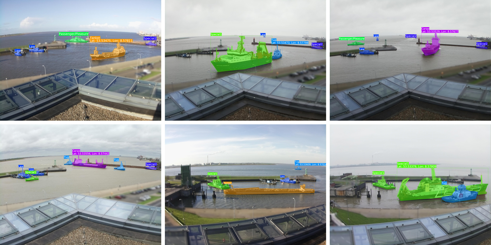

# ShipSG: Ship Segmentation and Georeferencing Dataset

The **ShipSG dataset** is the first public dataset of its kind for **ship segmentation and georeferencing**. It is designed for the **development and evaluation** of **instance segmentation and georeferencing methods** using computer vision and deep learning, contributing to the research field of **ship recognition for maritime situational awareness**.

ShipSG consists of:
- **3,505 images** of a port location captured with two different cameras (static and oblique views).
- **11,625 manually annotated ship masks**, categorized into **seven ship classes**.
- **Geographic annotations** (latitude and longitude) for one ship per image.

## 🚢 Example Dataset Samples

## 📜 Terms and Conditions
The dataset is released under the **Creative Commons BY-NC-ND 4.0 International** license. You may:
- **Share**: Copy and redistribute the material in any medium or format.
- **Attribution**: You must give appropriate credit and indicate if changes were made.
- **NonCommercial**: You may not use the material for commercial purposes.
- **NoDerivatives**: If you remix, transform, or build upon the material, you may not distribute the modified material.
- **No additional restrictions**: You may not impose legal terms that prevent others from doing what the license permits.

For citation, please use:

> Carrillo-Perez, B.; Barnes, S.; Stephan, M. Ship Segmentation and Georeferencing from Static Oblique View Images. *Sensors* 2022, *22*, 2713. DOI: [https://doi.org/10.3390/s22072713](https://doi.org/10.3390/s22072713)

## 🔑 Requesting Access
The dataset is **publicly available for download under request**. To request access:

1. **Go to the Zenodo dataset page**:  
   
2. Click **"Request Access"** on the dataset page.
3. Agree to the **license terms**.
4. Your request will be reviewed, and if approved, you will receive access via Zenodo.

If you need the dataset under a **different license (e.g., for commercial use)**, please contact us via Zenodo.
